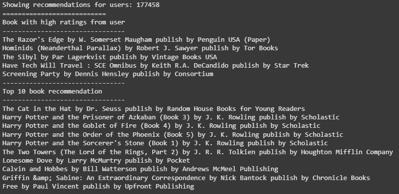
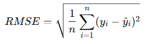

# Laporan Proyek Machine Learning - Muhammad Syarif Hidayat

## Project Overview

Sistem rekomendasi buku memainkan peran penting dalam membantu pembaca menemukan buku yang sesuai dengan minat dan preferensi mereka, terutama di era digital yang penuh dengan informasi. Tanpa sistem rekomendasi yang efektif, pengguna mungkin merasa kewalahan dengan banyaknya pilihan buku yang tersedia. Sistem ini tidak hanya meningkatkan pengalaman pengguna tetapi juga berkontribusi pada peningkatan penjualan dan kepuasan pelanggan.

**Pentingnya Sistem Rekomendasi Buku**</br>
1. **Personalisasi Pengalaman Pengguna** : Dengan menganalisis data pengguna, sistem rekomendasi dapat menyarankan buku yang sesuai dengan minat individu, meningkatkan kepuasan dan keterlibatan pengguna.</br>
2. **Meningkatkan Penjualan dan Loyalitas** : Rekomendasi yang tepat dapat meningkatkan kemungkinan pengguna membeli buku yang disarankan, memperkuat loyalitas pelanggan, dan meningkatkan kepuasan keseluruhan.</br>

**Relevansi dengan Tren Teknologi Terkini**</br>
Perkembangan teknologi, seperti penggunaan model bahasa besar (Large Language Models) seperti ChatGPT, telah membuka peluang baru dalam meningkatkan akurasi dan relevansi rekomendasi buku. Sistem seperti BookGPT mengintegrasikan teknologi ini untuk memberikan rekomendasi yang lebih personal dan kontekstual.</br>

**Tujuan Proyek**</br>
Proyek ini bertujuan untuk mengembangkan sistem rekomendasi buku berbasis data rating pengguna menggunakan pendekatan collaborative filtering. Dengan memanfaatkan dataset besar yang mencakup informasi buku dan interaksi pengguna, sistem ini diharapkan dapat memberikan rekomendasi yang relevan dan meningkatkan pengalaman membaca pengguna.


**REFERENSI**  
[The Importance of Recommendation Systems Nowadays](https://qymatix.de/en/recommendation-systems-nowadays/) 
[BookGPT: A General Framework for Book Recommendation Empowered by Large Language Model](https://arxiv.org/abs/2305.15673)

## Business Understanding

### Problem Statements

- Banyak pengguna yang kesulitan menemukan buku yang sesuai dengan preferensi mereka karena terlalu banyaknya pilihan buku yang tersedia di pasar, sehingga dapat mengurangi kepuasan dan pengalaman pengguna dalam memilih buku yang tepat.
- Sistem rekomendasi yang ada saat ini sering kali memberikan saran yang kurang relevan, terutama untuk pengguna baru (cold start) yang belum memiliki banyak data interaksi atau rating buku, sehingga mengurangi efektivitas sistem rekomendasi.
- Tanpa adanya sistem yang efektif, penjual buku atau platform pembaca tidak dapat memaksimalkan potensi penjualan melalui rekomendasi yang dipersonalisasi, yang dapat meningkatkan loyalitas pengguna.

### Goals

- Mengembangkan sistem rekomendasi buku yang dapat memberikan saran yang relevan berdasarkan data rating pengguna untuk membantu pengguna menemukan buku yang sesuai dengan minat dan preferensi mereka.
- Menggunakan pendekatan sistem rekomendasi berbasis collaborative filtering untuk menangani masalah cold start, sehingga dapat memberikan rekomendasi yang relevan bahkan untuk pengguna yang baru bergabung atau buku yang belum banyak diberi rating.
- Meningkatkan penjualan dan loyalitas pengguna dengan menyediakan rekomendasi buku yang dipersonalisasi yang relevan bagi setiap pengguna, meningkatkan pengalaman pembaca, dan mempermudah keputusan pembelian.

### Solution Approach
Untuk mencapai tujuan tersebut, berikut adalah dua pendekatan yang dapat digunakan dalam sistem rekomendasi berbasis collaborative filtering:
#### Solution statements
  - **Model Collaborative Filtering Berbasis User-Item**
    a. Pendekatan ini melibatkan pembuatan matriks interaksi antara pengguna dan buku yang mereka beri rating. Dengan menggunakan teknik seperti Matrix Factorization (misalnya Singular Value Decomposition atau SVD), kita dapat mengidentifikasi pola dan hubungan tersembunyi antara pengguna dan buku.
    b. Setiap pengguna akan diberikan rekomendasi berdasarkan kesamaan preferensi dengan pengguna lainnya yang memiliki pola rating yang mirip.
  - **Model Collaborative Filtering Berbasis Item-Item**
    a. Pendekatan ini lebih berfokus pada mencari buku yang memiliki kesamaan dengan buku yang sudah pernah diberi rating oleh pengguna. Misalnya, jika pengguna memberi rating tinggi untuk buku A, sistem akan mencari buku lain yang sering diberi rating tinggi oleh pengguna lain yang juga memberikan rating tinggi pada buku A.
    b. Teknik ini mengidentifikasi hubungan antar buku berdasarkan kesamaan pola interaksi dengan pengguna, dan memberikan rekomendasi buku yang serupa.

## Data Understanding
Dataset yang digunakan dalam proyek ini berasal dari Kaggle, yaitu [Book Recommendation Dataset](https://www.kaggle.com/datasets/arashnic/book-recommendation-dataset/data). Dataset ini mencakup tiga file utama yang menyediakan data terkait pengguna, buku, dan rating buku. Dataset ini digunakan untuk membangun sistem rekomendasi buku, dengan tujuan memberikan rekomendasi yang relevan kepada pengguna berdasarkan preferensi mereka.

### Jumlah Data dan Kondisi Data
Dataset ini memiliki data yang cukup besar, dengan jumlah pengguna, buku, dan rating yang bervariasi. Data pengguna, buku, dan rating masing-masing disimpan dalam file terpisah. Berikut adalah gambaran umum mengenai isi dataset :
1. **Users Dataset**
  a. Terdapat informasi tentang pengguna yang memberikan rating, meskipun ID pengguna telah dianonimkan.
  b. Beberapa data demografis pengguna juga tersedia, seperti lokasi dan usia, meskipun ada banyak nilai NULL di kolom ini.
2. **Books Dataset**
a. Data buku diidentifikasi berdasarkan ISBN, dengan informasi tambahan mengenai judul buku, penulis, tahun publikasi, dan penerbit.
b. Beberapa URL untuk gambar sampul buku juga disediakan dalam tiga ukuran (S, M, L).
3. **Ratings Dataset**
a. Dataset ini berisi informasi tentang rating yang diberikan oleh pengguna terhadap buku. Rating diberikan pada skala 1-10, dengan nilai yang lebih tinggi menunjukkan penghargaan yang lebih tinggi terhadap buku tersebut. Beberapa rating bersifat implisit, yang ditandai dengan nilai 0.

Variabel-variabel pada Book Recommendation Dataset dataset adalah sebagai berikut :
- User-ID : ID pengguna yang telah dianonimkan, diwakili oleh angka integer.
- Location : Lokasi geografis pengguna (misalnya negara atau kota), dapat berisi nilai NULL.
- Age: Usia pengguna, dapat berisi nilai NULL jika tidak tersedia.
- ISBN: ISBN buku yang digunakan sebagai pengidentifikasi unik buku.
- Book-Title: Judul buku.
- Book-Author: Penulis buku (hanya penulis pertama yang ditampilkan jika ada beberapa penulis).
- Year-Of-Publication: Tahun publikasi buku.
- Publisher: Penerbit buku.
- Image-URL-S: URL gambar sampul buku dalam ukuran kecil.
- Image-URL-M: URL gambar sampul buku dalam ukuran medium.
- Image-URL-L: URL gambar sampul buku dalam ukuran besar.
- Book-Rating: Rating buku yang diberikan oleh pengguna (bernilai 1-10 atau 0 untuk rating implisit).

### **Exploratory Data Analysis (EDA)**
- **Dataset**
  1. Books (book)
    a. **Struktur Data** :
      - Jumlah baris: 271.360
      - Jumlah kolom: 8 kolom
      - Semua kolom bertipe object.
      - Fitur: ISBN, Book-Title, Book-Author Year-Of-Publication, Publisher, Image-URL-S Image-URL-M, Image-URL-L.
    b. **Temuan**
      - Ada missing value pada kolom Book-Author, Publisher, Image-URL-L
    c. **Statistik Penting**
      - Jumlah buku unik berdasarkan ISBN: 271.360
      - Jumlah author unik: 102.023
      - Jumlah publisher unik: 16.808
  2. Ratings (ratings)
    a. **Struktur Data** :
      - Jumlah baris: 1.149.780
      - Jumlah kolom: 3 kolom (User-ID, ISBN, Book-Rating)
      - Tipe data :
        - 2 kolom bertipe int64 (User-ID, Book-Rating)
        - 1 kolom bertipe object (ISBN)

      b. **Statistik Penting** :
      - Book-Rating (0–10)
        - Mean: 2.87
        - Median (50%): 0.0 (menunjukkan banyak rating kosong atau 0)
        - Max: 10
        - Banyak rating nol → menunjukkan mungkin rating kosong atau belum diberi rating oleh pengguna.
      - Jumlah user yang memberikan rating: 105.283
      - Jumlah buku yang pernah diberi rating: 340.556
  3. Users (users)

      a. **Struktur Data**
      - Jumlah baris: 278.858
      - Jumlah kolom: 3 kolom (User-ID, Location, Age)
      - Tipe data :
        - 1 kolom int64 (User-ID)
        - 1 kolom object (Location)
        - 1 kolom float64 (Age)

      b. **Temuan** :
      - Ada missing value pada kolom Age.
      - Age memiliki nilai:
        - Minimum: 0 tahun (mungkin error)
        - Maksimum: 244 tahun (tidak masuk akal → kemungkinan perlu dibersihkan)
      - Jumlah user unik: 278.858
      - Jumlah lokasi unik: 57.339
### **🔍 Insight Awal :**
1. Data Books perlu dilakukan : Handling missing value di kolom Book-Author, Publisher, dan Image-URL-L.
2. Data Ratings menunjukkan : Banyak nilai rating 0 → kemungkinan artinya belum memberi rating atau kosong → perlu dianalisis.
3. Data Users perlu :
    - Handling nilai age ekstrim (0 dan 244) → mungkin diimputasi atau dibuang
    - Banyak variasi lokasi → bisa dikategorisasi berdasarkan negara/kota.

## Data Preparation
Dalam tahapan Data Preparation ini, beberapa teknik telah diterapkan untuk memastikan data siap digunakan dalam analisis atau model. Berikut adalah proses-proses yang dilakukan :

- **Mengatasi Missing Value pada Rating**
1. **Proses** : Mengecek adanya missing value pada dataset ratings. Namun, ternyata tidak ada nilai yang hilang pada kolom User-ID, ISBN, dan Book-Rating, karena hasilnya menunjukkan jumlah missing value adalah 0.
2. **Alasan** : Memastikan tidak ada data yang hilang dalam kolom penting seperti User-ID, ISBN, dan Book-Rating, yang dapat mengganggu proses analisis atau modeling lebih lanjut.

- **Menghapus Rating yang Tidak Valid**
1. **Proses** : Menghapus rating yang bernilai 0 pada dataset ratings, karena rating 0 biasanya mengindikasikan bahwa pengguna tidak memberikan rating yang valid.
2. **Alasan** : Rating 0 tidak memberikan informasi yang berguna untuk sistem rekomendasi atau analisis lainnya. Oleh karena itu, nilai rating 0 harus dihapus agar hasil analisis lebih akurat.

- **Encoding User-ID dan ISBN**
1. **Proses** :
    - Melakukan encoding pada kolom User-ID dan ISBN untuk mengganti nilai string dengan angka yang lebih mudah digunakan dalam model pembelajaran mesin. Dua dictionary mapping dibuat :
      - user_to_user_encoded untuk encoding User-ID
      - book_to_book_encoded untuk encoding ISBN
    - Proses ini memetakan nilai-nilai unik User-ID dan ISBN ke dalam angka.
2. **Alasan** : Beberapa algoritma, seperti algoritma pembelajaran mesin atau model rekomendasi, memerlukan data numerik. Oleh karena itu, encoding ini mempermudah pengolahan data lebih lanjut.

- **Mengubah Rating menjadi Float**
1. **Proses** : Kolom Book-Rating diubah menjadi tipe data float32, yang lebih efisien dan sesuai untuk analisis numerik.
2. **Alasan** : Menyelaraskan tipe data dengan tipe yang sesuai agar proses perhitungan menjadi lebih efisien dan konsisten, serta menghindari kesalahan saat melakukan perhitungan atau analisis.

- **Mengatasi Missing Value pada Buku**
1. **Proses** : Pada dataset all_book, ditemukan adanya missing value pada kolom-kolom seperti Book-Title, Book-Author, Year-Of-Publication, dan Publisher. Missing value pada kolom tersebut kemudian dibersihkan dengan menggunakan fungsi dropna().
2. **Alasan** : Data yang hilang pada kolom-kolom penting ini dapat mengganggu analisis dan membuat sistem rekomendasi tidak dapat berfungsi dengan baik. Menghapus missing value menjamin bahwa setiap buku memiliki informasi yang lengkap.

- **Menghapus Data Duplikat pada Buku**
1. **Proses** : Menghapus data duplikat pada dataset buku berdasarkan kolom ISBN, untuk memastikan bahwa setiap buku hanya muncul satu kali.
2. **Alasan** : Duplikasi dapat menyebabkan ketidaktepatan dalam analisis, seperti menghitung jumlah buku yang lebih besar dari yang seharusnya. Oleh karena itu, penghapusan duplikat sangat penting agar dataset tetap akurat.

- **Menghapus Rating yang Tidak Valid pada Buku**
1. **Proses** : Menghapus buku yang memiliki rating 0 di dataset preparation. Hal ini dilakukan untuk memastikan hanya buku yang memiliki rating yang valid yang digunakan dalam analisis.
2. **Alasan** : Rating 0 dapat menyesatkan dalam analisis, karena biasanya itu menunjukkan bahwa pengguna tidak memberikan rating atau rating tersebut kosong.

- **Menyusun Data Buku**
1. **Proses** : Setelah proses pembersihan dan penghapusan duplikat, data buku disusun berdasarkan kolom ISBN dan dimasukkan ke dalam book_new yang berisi kolom id, book_name, book_author, dan publisher.
2. **Alasan** :Proses ini menyederhanakan data buku yang dapat digunakan dalam analisis atau model rekomendasi. Kolom yang dibutuhkan telah dipilih, dan data yang tidak diperlukan sudah dibersihkan.

- **Memastikan Konsistensi Data**
1. **Proses** : Selama tahapan pembersihan, kita juga memastikan bahwa data buku yang ada konsisten, sehingga jumlah buku yang unik tetap terjaga dengan nilai yang sesuai.
2. **Alasan** : Konsistensi data penting untuk memastikan hasil analisis atau model yang dibangun berdasarkan data ini memiliki dasar yang kuat dan tidak terdistorsi oleh kesalahan data.

- **Resample Data (Pengacakan)**
1. **Proses** : Data diacak ulang menggunakan sample(frac=1, random_state=42) untuk menyusun ulang baris-baris pada dataframe secara acak.
2. **Alasan** : Pengacakan diperlukan sebelum melakukan pembagian data agar distribusi data tidak bias, misalnya tidak terkonsentrasi pada user atau rating tertentu.

- **Menyiapkan Input Fitur dan Target**
1. **Proses** : Membentuk variabel x sebagai pasangan user dan book, serta y sebagai rating.
2. **Alasan** : Data dalam format pasangan user-book digunakan sebagai input model, sedangkan rating digunakan sebagai target untuk dilatih oleh model rekomendasi.

- **Melakukan Normalisasi Rating**
1. **Proses** : Nilai rating dinormalisasi ke rentang [0, 1] dengan rumus :
```
y = df['rating'].apply(lambda x: (x - min_rating) / (max_rating - min_rating)).values
```
2. **Alasan** : Normalisasi diperlukan karena model neural network menggunakan fungsi aktivasi sigmoid yang bekerja optimal dengan nilai dalam rentang [0, 1].

- **Split Dataset (Training dan Validasi)**
1. **Proses** : Dataset dibagi menjadi 80% data latih dan 20% data validasi :
```
train_indices = int(0.8 * df.shape[0])
x_train, x_val = x[:train_indices], x[train_indices:]
y_train, y_val = y[:train_indices], y[train_indices:]
```
2. **Alasan** : Pembagian dataset ini bertujuan untuk mengevaluasi performa model pada data yang tidak dilihat selama pelatihan, sehingga menghindari overfitting.

## Modeling
Untuk sistem rekomendasi ini, kami menggunakan pendekatan collaborative filtering, memanfaatkan matrix factorization dengan embedding untuk pengguna dan buku. Tujuannya adalah untuk memprediksi interaksi pengguna-buku (rating) dengan memasukkan pengguna dan buku ke dalam ruang laten berdimensi rendah dan menghitung interaksi di antara keduanya.

- **Pendekatan 1: Neural Collaborative Filtering**
Model ini menggunakan embedding untuk memetakan pengguna dan buku ke dalam ruang laten bersama. Arsitektur melibatkan lapisan-lapisan berikut :
  - **User Embedding** : Embedding yang dapat dilatih untuk setiap pengguna, yang menangkap preferensi pengguna.
  - **Book Embedding** : Embedding yang dapat dilatih untuk setiap buku, yang menangkap fitur buku.
  - **Bias Terms** : Bias terpisah untuk pengguna dan buku, yang mengakomodasi tren umum dalam rating.
  - **Dot Product** : Model menghitung interaksi antara embedding pengguna dan buku melalui produk titik.</br></br>

- **Fungsi Aktivasi dan Loss**
1. Model ini menggunakan aktivasi sigmoid untuk mengecilkan output ke dalam rentang [0, 1].
2. Fungsi kerugian binary cross-entropy dipilih untuk melatih model, karena kita memprediksi kemungkinan rating dalam rentang yang dinormalisasi.

- **Pendekatan Alternatif (Matrix Factorization tanpa Neural Networks)**
Sebagai perbandingan dengan model neural collaborative filtering, metode SVD (Singular Value Decomposition) atau ALS (Alternating Least Squares) bisa diterapkan untuk faktorisasi matriks. Meskipun SVD lebih efisien secara komputasi, ia mungkin tidak mampu menangkap pola yang kompleks seperti yang dapat dilakukan oleh neural network.</br></br>

- **Kelebihan dan Kekurangan**
1. **Kelebihan** : Neural networks dapat mempelajari interaksi non-linear yang kompleks antara pengguna dan buku, yang berpotensi menghasilkan rekomendasi yang lebih akurat.
2. **Kekurangan** : Neural collaborative filtering membutuhkan lebih banyak sumber daya komputasi dan bisa lebih rentan terhadap overfitting jika tidak dipregularisasi dengan benar.

**Pembagian Data untuk Pelatihan dan Validasi**
Data dibagi menjadi :
- Set Pelatihan (80%): Digunakan untuk melatih model.
- Set Validasi (20%): Digunakan untuk mengevaluasi kemampuan generalisasi model.

Model dilatih selama 5 epoch, dengan ukuran batch 8 dan menggunakan optimizer Adam dengan learning rate 0.001.

- **Mendapatkan Rekomendasi Top-N**</br>
Output akhir terdiri dari rekomendasi untuk pengguna yang dipilih secara acak, dengan menunjukkan :
  1. Buku yang sudah diberi rating tinggi oleh pengguna, dan
  2. Top-N rekomendasi buku berdasarkan rating yang diprediksi untuk buku yang belum diberi rating oleh pengguna.

**Contoh Hasil Inference**
<p align="center">
  
</p>

## Evaluation
Untuk mengevaluasi model, kami menggunakan Root Mean Squared Error (RMSE) sebagai metrik utama. RMSE adalah metrik yang umum digunakan untuk sistem rekomendasi berbasis regresi untuk mengukur perbedaan antara rating yang diprediksi dan rating yang sebenarnya.
Formula RMSE adalah :
<p align="center">
  
</p>

Dimana :</br>
- 𝑦𝑖 adalah rating aktual.</br>
- 𝑦 hat 𝑖 adalah rating yang diprediksi.</br>
- n adalah total jumlah prediksi.

Dalam kasus ini, nilai RMSE adalah :</br>
- RMSE Training: ~0.1725</br>
- RMSE Validasi: ~0.1958

**Visualisasi Hasil Evaluasi**
<p align="center">
  
</p>

Foto tersebut menampilkan grafik yang memvisualisasikan metrik evaluasi model, khususnya Root Mean Squared Error (RMSE), selama proses pelatihan (training) dan pengujian (testing/validation) pada setiap epoch.

- **Sumbu Y (root_mean_squared_error)**
1. Menunjukkan nilai RMSE, yang mengukur seberapa besar kesalahan prediksi model. Nilai RMSE berkisar antara 0.18 hingga 0.24.
2. Semakin rendah nilai RMSE, semakin baik performa model.

- **Sumbu X (epoch)**
Menunjukkan jumlah epoch (iterasi pelatihan), dari 0 hingga 4.</br></br>

- **Garis Grafik**
1. Garis 'train' (biru) : RMSE pada data pelatihan, yang menurun seiring bertambahnya epoch, menunjukkan model semakin belajar.
2. Garis 'test' (oranye) : RMSE pada data validasi, yang juga menurun tetapi lebih fluktuatif, terutama setelah epoch 1.5.

- **Interpretasi**
1. Penurunan RMSE pada data pelatihan dan validasi menunjukkan model mampu belajar dengan baik tanpa overfitting (kesenjangan antara kedua garis tidak melebar signifikan).
2. Fluktuasi RMSE validasi mungkin disebabkan oleh ukuran dataset yang terlalu besar atau noise dalam data.

- **Keterkaitan Evaluasi dengan Business Understanding**
Evaluasi model dengan RMSE yang rendah (~0.1958 pada validasi) menunjukkan bahwa model memiliki kemampuan prediktif yang baik. Hal ini mendukung dan menjawab beberapa aspek dari business understanding sebagai berikut :
1. **Menjawab Problem Statements**
a. **Masalah Relevansi Rekomendasi**
Dengan performa prediktif yang akurat (RMSE rendah), model dapat memberikan rekomendasi yang lebih relevan dan personal kepada pengguna, mengurangi rasa kebingungan akibat banyaknya pilihan buku.
b. **Masalah Cold Start**
Model ini dibangun menggunakan pendekatan collaborative filtering, yang sudah diuji dengan hasil RMSE yang stabil. Hal ini mendukung kemampuan model dalam mengatasi cold start secara lebih efektif, terutama bila dikombinasikan dengan teknik hybrid atau matrix completion.
c. **Masalah Potensi Penjualan**
Model yang dapat memberi rekomendasi akurat dapat meningkatkan kemungkinan pembelian dari pengguna, sehingga memberi dampak positif terhadap potensi penjualan dan loyalitas pengguna.

2.  **Mencapai Goals**
a. **Sistem rekomendasi relevan**
Evaluasi membuktikan model dapat memprediksi rating secara akurat sehingga mendukung pengembangan sistem yang merekomendasikan buku sesuai preferensi pengguna.
b. **Mengatasi cold start**
RMSE validasi yang rendah menandakan bahwa model tidak terlalu tergantung pada volume data per pengguna/buku, memperkuat solusi terhadap pengguna baru.
c. **Meningkatkan loyalitas pengguna dan penjualan**
Rekomendasi yang lebih akurat dan relevan akan meningkatkan kepuasan pengguna dan mendorong interaksi lebih lanjut, selaras dengan tujuan bisnis.

3. **Mendukung Solution Statements**
a. **Collaborative Filtering (User-Item & Item-Item)**
Evaluasi dilakukan terhadap pendekatan yang sesuai dengan rencana solusi (user-item matrix dengan matrix factorization), dan terbukti efektif dengan RMSE rendah pada validasi, menunjukkan metode ini berhasil menangkap pola dan preferensi pengguna.

- **Kesimpulan**
Model menunjukkan performa yang sangat baik dan stabil dalam memprediksi rating buku. Hal ini mendukung tujuan bisnis secara menyeluruh, yaitu meningkatkan pengalaman pengguna, merekomendasikan buku yang relevan, dan mendorong konversi serta loyalitas pengguna. Jika pelatihan dilanjutkan, model berpotensi semakin stabil atau mencapai konvergensi. Namun, perlu dipantau risiko overfitting jika RMSE validasi mulai meningkat.
